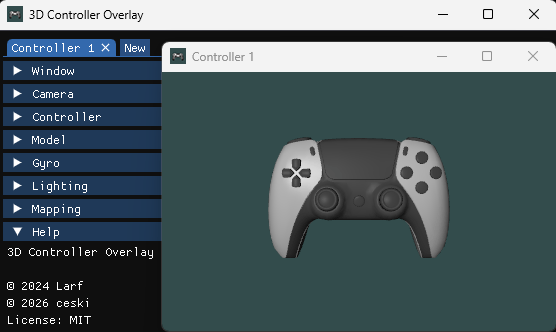

# 3D Controller Overlay

3D Controller Overlay is a simple program for content creaters to show what their controller is doing in 3D space without the need for a handcam.

[](https://github.com/ceski-1/3d-controller-overlay/releases/latest)

## Download

Windows and Linux binaries are provided on the [Releases](https://github.com/ceski-1/3d-controller-overlay/releases/latest) page. To build from source, see [Compiling](#compiling).

## Compiling

Requirements:

- [CMake](https://cmake.org) (3.16 or later)
- [glad](https://github.com/Dav1dde/glad/tree/v0.1.36) (0.1.36, gl 3.3, core profile)
- [GLFW](https://github.com/glfw/glfw) (3.4 or later)
- [glm](https://github.com/g-truc/glm) (1.0.3 or later)
- [imgui](https://github.com/ocornut/imgui) (1.92.8 or later)
- [imgui-filebrowser](https://github.com/AirGuanZ/imgui-filebrowser) (latest)
- [SDL3](https://github.com/libsdl-org/SDL) (latest)
- [stb](https://github.com/nothings/stb) (stb_image.h 2.30 or later)

For Windows, [vcpkg](https://github.com/microsoft/vcpkg) is recommended. For Linux, use the libraries provided by your distribution.

Clone the repository:

```
git clone https://github.com/ceski-1/3d-controller-overlay.git
```

Configure (if using vcpkg):

```
cmake -B build -DCMAKE_TOOLCHAIN_FILE="<path_to_vcpkg>/scripts/buildsystems/vcpkg.cmake"
```

Configure (if not using vcpkg):

```
cmake -B build
```

Build:

```
cmake --build build --config Release
```

## License

3D Controller Overlay is licensed under the MIT License, see [LICENSE](https://github.com/ceski-1/3d-controller-overlay/blob/main/LICENSE) for more information.
